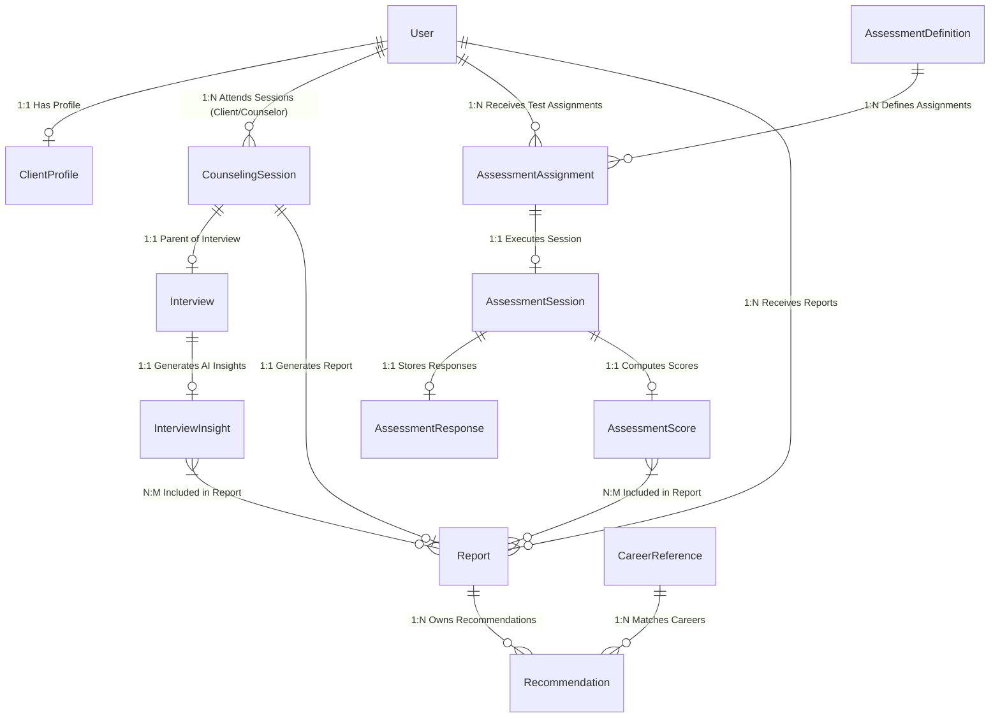

# Core Domain Entity Relationship Diagram & Architecture

**Document Owner**: Database & Backend Architecture Team  
**Scope**: Career Counseling Platform Domain Models  
**Status**: Production Ready  

---

## 1. Data Layer Classification Architecture

In alignment with Clean Architecture and the PRD, database models are strictly segregated across 6 distinct data layers:

| Layer | Domain Models | Description |
| :--- | :--- | :--- |
| **User & Profile** | `User`, `ClientProfile` | Identity, authentication credentials, demographic data, education history, and academic files. |
| **Parent Pipeline** | `CounselingSession` | **Parent entity** for all counseling engagements. Statuses: SCHEDULED, CONFIRMED, COMPLETED, CANCELLED, NO_SHOW. Holds notes, attachments, interview, and future OCR/Audio/Transcript/AI Summary placeholders. |
| **Raw & Calculated Data** | `AssessmentAssignment`, `AssessmentSession`, `AssessmentResponse`, `AssessmentScore` | Counselor-assigned test suite, raw user answers, Likert scores, dimension percentiles. |
| **Human & AI Insights** | `Interview`, `InterviewInsight` | Counselor interview session notes, stated goals, speech transcripts, OCR notes, sentiment scores. |
| **Career Reference & Reports** | `Report`, `Recommendation`, `CareerReference` | Finalized immutable reports containing assessment results, interview insights, recommendations, career matches, action plans, report versions, and edit history. **Recommendations belong to Reports.** |

---

## 2. Entity Relationship Diagram (ERD)

---

## 3. Relationship Explanations & Justification

### Parent Pipeline Entity Architecture

1. **`CounselingSession` as Parent Entity**:
   - **Why it exists**: `CounselingSession` is the single source of truth for the counseling engagement. Status flow: `SCHEDULED` ➔ `CONFIRMED` ➔ `COMPLETED` (or `CANCELLED` / `NO_SHOW`). Holds notes, attachments, interview logs, and placeholders for future OCR, Audio, Transcript, and AI Summaries.

2. **`Recommendation` Belongs to `Report` (NOT directly to Student)**:
   - **Why it exists**: Recommendations are contextual outputs bound to specific published report versions. They are linked via `reportId`.

3. **Immutable Finalized Reports & Versioning**:
   - **Why it exists**: Once published, a report becomes immutable (`isFinalized: true`). Any updates generate a new `Report` version (`version: N+1`, `parentReportId: previousId`) with full `editHistory` tracking.

---

## 4. Future Compatibility Matrix

| Future Feature | Supported Model & Schema Extension |
| :--- | :--- |
| **Counseling Session Pipeline** | Supported via `CounselingSession` parent entity. |
| **Speech-to-Text & Audio** | Supported via `CounselingSession.futureAudio` and `futureTranscript`. |
| **OCR Document Parsing** | Supported via `CounselingSession.futureOcr`. |
| **AI Summaries & Sentiment** | Supported via `CounselingSession.futureAiSummary`. |
| **Immutable Reports & Editing** | Supported via `Report.isFinalized`, `Report.version`, `Report.parentReportId`, and `Report.editHistory`. |
| **Recommendations** | Supported via `Recommendation.reportId` (belonging to Report). |

---

## 5. Architectural Review & Performance Strategy

1. **Scalability**: High throughput read performance enabled by normalized references. Large text blocks (transcripts, OCR) are segregated into secondary insight models.
2. **Indexing Strategy**:
   - Unique single field indexes on `User.email`, `ClientProfile.userId`, `AssessmentDefinition.code`, `CareerReference.onetCode`.
   - Compound indexes: `CounselingSession({ counselorId: 1, scheduledAt: 1 })`, `Recommendation({ reportId: 1, matchScore: -1 })`, `Report({ studentId: 1, status: 1 })`.
3. **Security**: Sensitive auth credentials isolated in `User.password` with `select: false`. Profile data protected by user ObjectId bounds.
